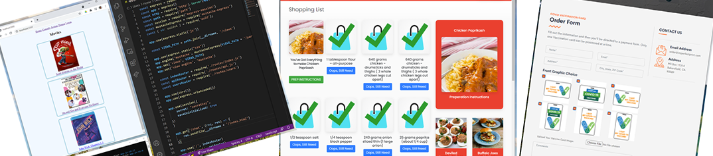
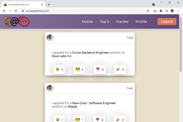
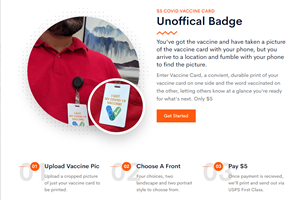
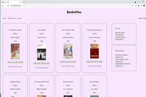
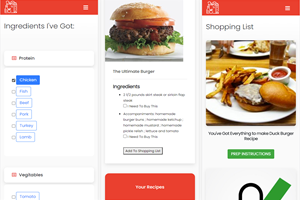
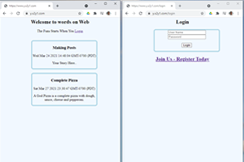
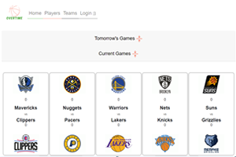

### Welcome to My GitHub Profile

- I've completed the 16-Week DigitalCrafts Coding Bootcamp in May 2021!

### Assignment/Project Overviews

## [Succeed At Failing](https://succeedatfailing.com/)

As we search for jobs, there is not really any support from your community when you're just submitting applications. This app is a social platform that lets you applaud and support your fellow developers through sharing emojis in the feed showing applications submitted and rejection letters recieved. There is also a small competitive part with our top 5, to help in modivating to submit more applications.

Using React we've made it responsive. [View Code](https://github.com/jorgecuza92/happy-sad)

## [Imperfect Print](https://imperfectprint.com/)

Bring your credit card to this site and make a purchase! This project uses React for the client side. The server side is NodeJS and features the use of express, jsonwebtoken, uuid, sequelize, dotenv, formidable, nodemailer and bcryptjs. [View Code](https://github.com/AgentLopez/Week14)

## Books4You

 

Full-Stack Web Application with React, Redux, and JSON Web Token. [View Code](https://github.com/AgentLopez/Week13) 

## [Munchie Gourmet](http://munchiegourmet.com/)

 

Got some ingredients in your kitchen? Let's find out what you can make! Once you've chosen a recipe, you can select what ingredients you need to create a shopping list for you to take to the store, come back and view preperation instructions on the recipes website. [View Code](https://github.com/AgentLopez/Week9) 

## Blog

 

Read more about the Full Stack - External Database assigments I finished. [View Code](https://github.com/AgentLopez/Week8) 

## Overtime

 

Check out our first group project. It's a client side JavaScript API consuming app. [View Code](https://github.com/AgentLopez/HoopsWizard)

### Spot AgentLopez on the Web

- [Linked-In](https://www.linkedin.com/in/agentlopez/)  You know, because let money = 1000000000000 doesn't work.

- [AgentLopez HQ](https://www.agentlopez.com/)  My personal website.

<!--
**AgentLopez/AgentLopez** is a ✨ _special_ ✨ repository because its `README.md` (this file) appears on your GitHub profile.

Here are some ideas to get you started:

- 🔭 I’m currently working on ...
- 🌱 I’m currently learning ...
- 👯 I’m looking to collaborate on ...
- 🤔 I’m looking for help with ...
- 💬 Ask me about ...
- 📫 How to reach me: ...
- 😄 Pronouns: ...
- ⚡ Fun fact: ...
-->
